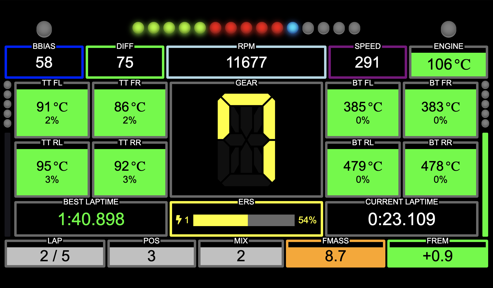

# SRDash - SimRacing Dashboard [](https://travis-ci.com/adlerre/srdash) [](https://www.codacy.com/gh/adlerre/srdash/dashboard?utm_source=github.com&amp;utm_medium=referral&amp;utm_content=adlerre/srdash&amp;utm_campaign=Badge_Grade)

A Java app to consume UDP telemetry data from Codemaster's F1 2018/2019/2020/2021 video game and present as simple dashboard. Based on the documentation provided at https://forums.codemasters.com/discussion/136948/f1-2018-udp-specification.

Project based on work of [eh7n](https://github.com/eh7n/f1-2018_telemetry).



## Usage

Run on commandline with:
```shell
java -jar srdash.jar --help
```

### Commandline Options

* **--configDir, -cd**<br />
  
  Set configuration dir.
  
* **-h, --help**<bbr />

  Print help (this message) and exit.
  
* **--host**<br />

  Set host listen on
  
* **--port, -p**<br />
  *Default:* `8085`<br />
  
  Set port listen on
  
* **--telemetryVersion, -tv**<br />
  
  Set telemetry version